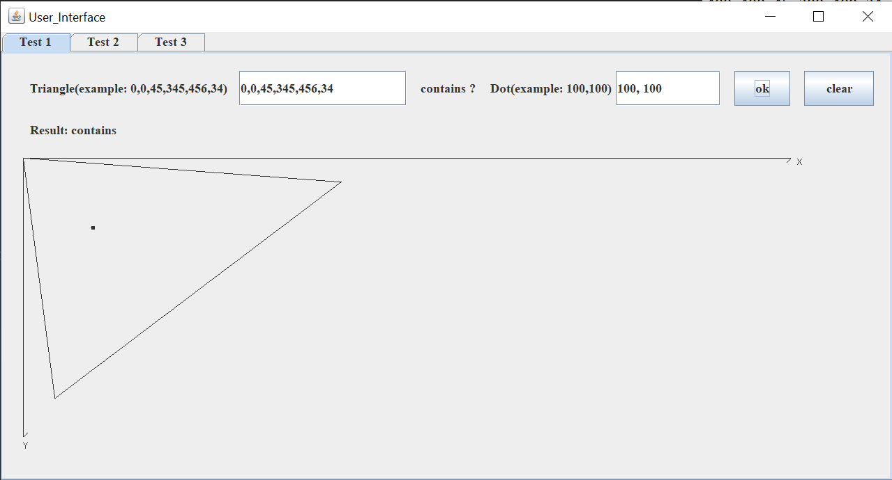
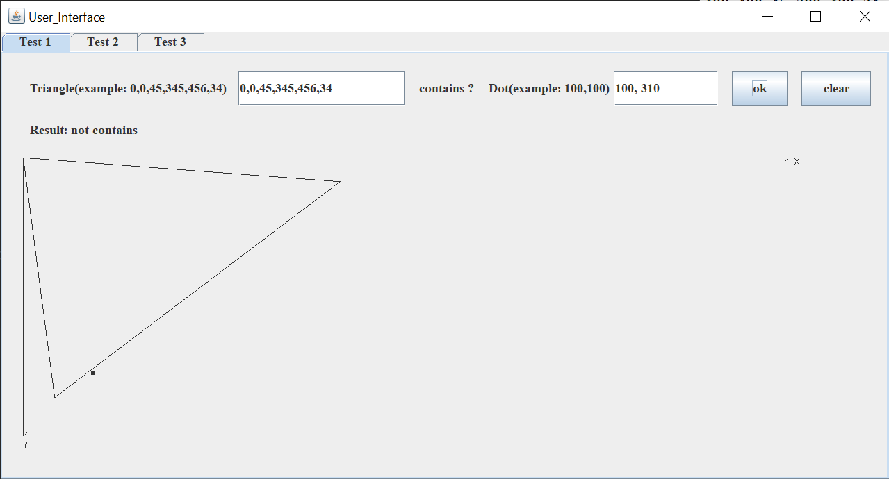
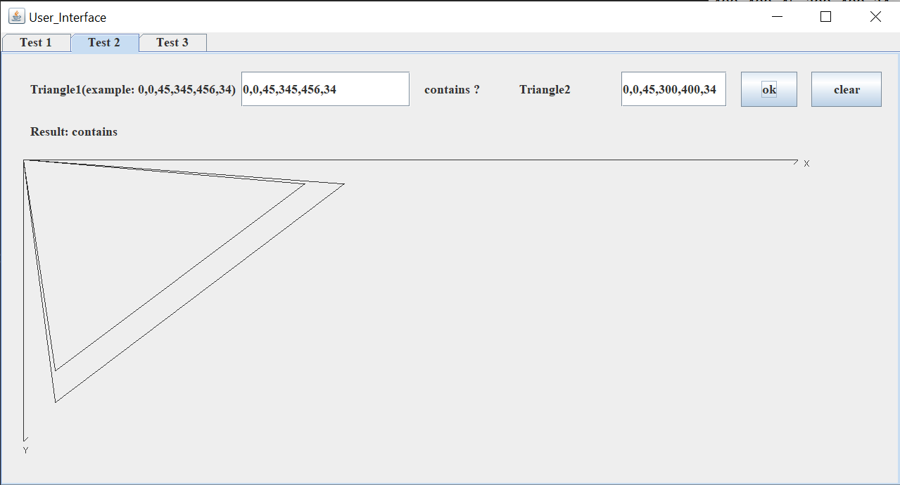
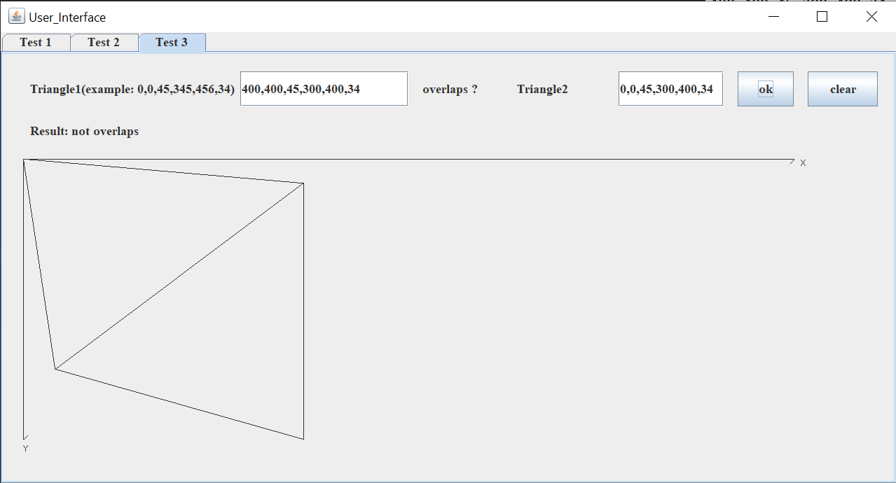
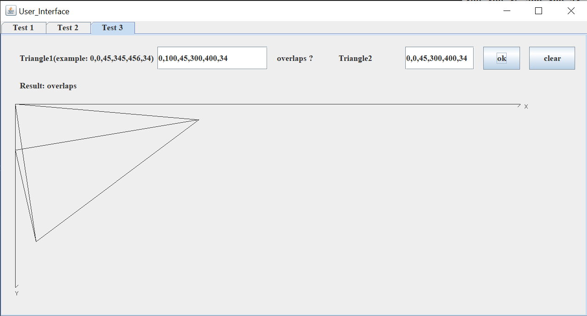
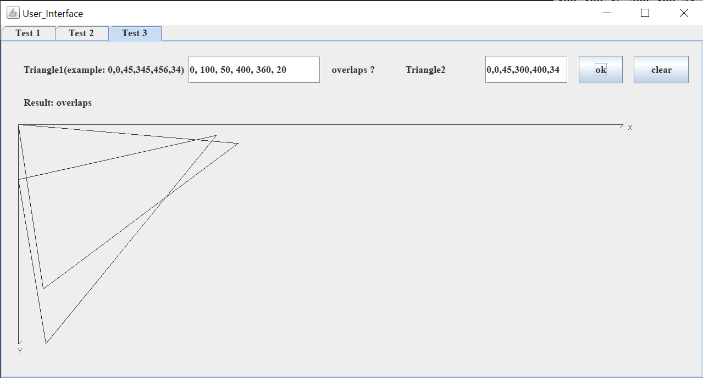
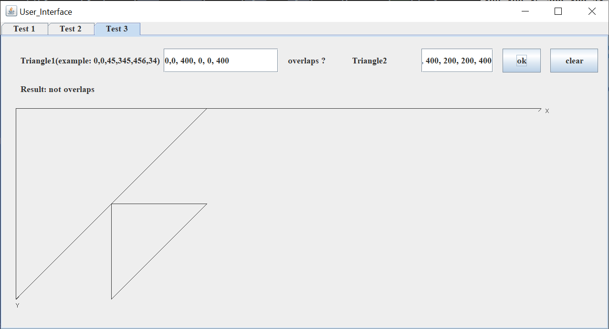
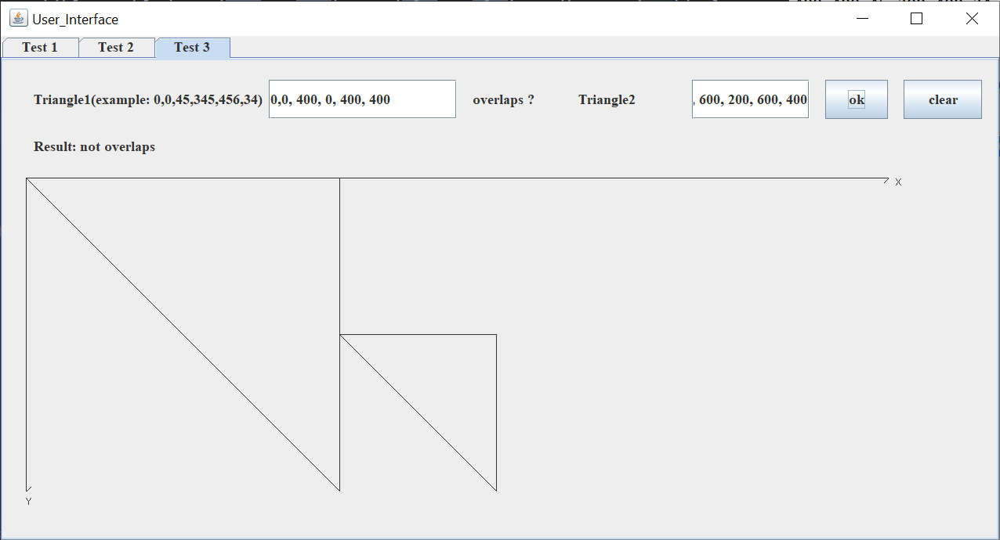

## Triangle-Contains-Or-Overlaps

### Test 1
#### Check if the triangle contains a dot

### Test 2
#### Check if the triangle contains another triangle

### Test 3
#### Check if two triangles overlap

