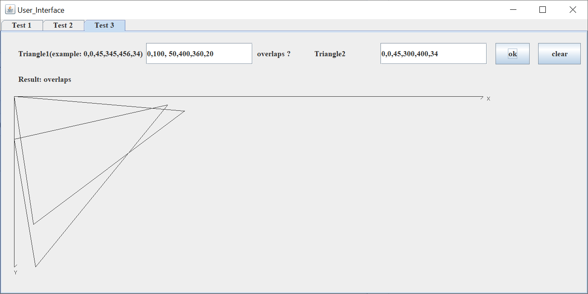
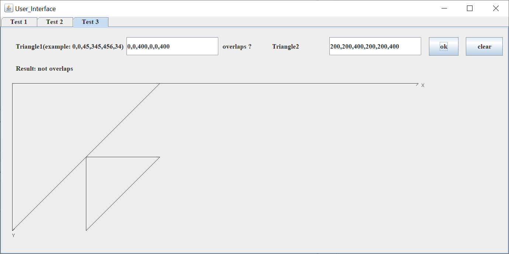

# Triangle Contains Or Overlaps

## Introduction

This program can help you to determine if a point is in a 2D triangle, and if a 2D triangle contains or overlaps with another 2D triangle.

## Math Foundations

### Area of Triangle

Given the coordinates of the three vertices of a triangle ABC, the area can be calculated by:

  $area=|\frac{A_x(B_y-C_y) + B_x(C_y-A_y) + C_x(A_y-B_y)}{2}|$

Here is the proof:

$area_{ABED}=\frac{(AD+BE) \cdot DE}{2}=\frac{(A_Y+B_Y) \cdot (B_x-A_x)}{2}$

$area_{BCFE}=\frac{(BE+CF) \cdot EF}{2}=\frac{(B_y + C_y) \cdot (C_x-B_x)}{2}$

$area_{ACFD}=\frac{(AD+CF)\cdot DF}{2}=\frac{(A_y + C_y)\cdot (C_x-A_x)}{2}$

$area_{ABC} = area_{ABED}+area_{BCFE}-area_{ACFD} $

Therefore,

$ area_{ABC} = \frac{A_x(C_y-B_y) + B_x(A_y-C_y) + C_x(B_y-A_y)}{2} = |\frac{A_x(B_y-C_y) + B_x(C_y-A_y) + C_x(A_y-B_y)}{2}|$

And the shape of the triangle might change, but we can always relabel the vertices to make sure $A_x \le B_x \le C_x$, and then use the method above to prove.

## Demo

### Test 1

Check if a point is in a triangle:

### Test 2

Check if the triangle contains another triangle:

### Test 3

Check if two triangles overlap with each other:

